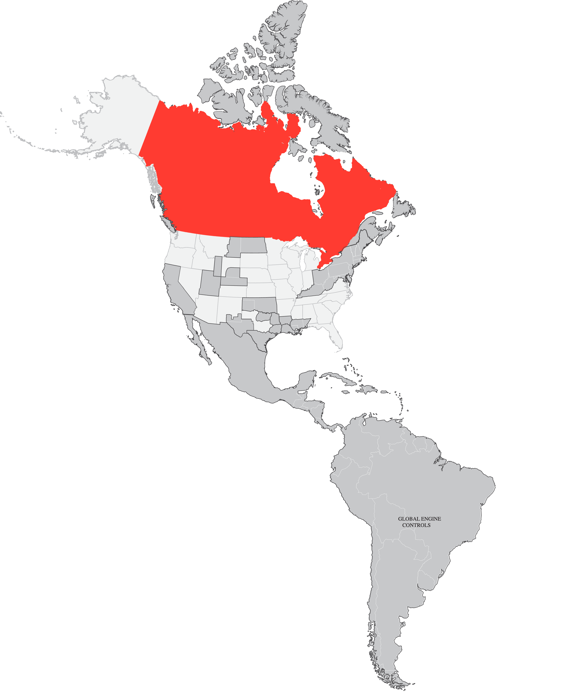

# Interactive Americas Contact Map

An interactive SVG map of the Americas with clickable regions that display contact information in a modal popup.



## Features

- 🗺️ Interactive map regions that highlight red on hover
- 📞 Click regions to view contact information in a modal popup
- 🏢 Company logos displayed under company names
- 📱 Responsive design for mobile and desktop
- ⌨️ Keyboard accessible (ESC to close modal)
- 🎨 Modern, clean UI with smooth animations

## Project Structure

```
maps/
├── index.html              # Main HTML file
├── css/
│   └── style.css          # Styles for map and modal
├── js/
│   └── app.js             # JavaScript logic and contact data
├── img/
│   ├── maps.svg           # SVG map file
│   └── logos/             # Company logo files (place logos here)
├── LOGO_INSTRUCTIONS.md   # Guide for adding logo files
└── REGION_MAPPING_GUIDE.md # Guide for mapping SVG regions to contact data
```

## Setup Instructions

### 1. Add Logo Files

Place all company logo files in the `img/logos/` directory. See [LOGO_INSTRUCTIONS.md](LOGO_INSTRUCTIONS.md) for the complete list of required logo files.

Required logos:
- excite.png
- primec.png
- wyss.png
- alleghany.png
- pneumatic.png
- sivalls.png
- westernsky.png
- spindletop.png
- bobdavis.png
- qualitycontrol.png
- strategic.png
- gec.png

### 2. Configure SVG Regions

Ensure your SVG map has properly named layers/groups. See [REGION_MAPPING_GUIDE.md](REGION_MAPPING_GUIDE.md) for details on:
- How regions are matched to contact data
- SVG structure requirements
- Adding new regions

### 3. Open in Browser

Simply open `index.html` in a web browser. No build process or server required!

## How It Works

1. **Hover Effect**: Grey regions (`rgb(199, 200, 202)`) turn red on hover
2. **Click to View**: Click any region to open a modal with contact information
3. **Modal Display**: Shows company name, logo, and contact details (area, phone, email, address)
4. **Close Modal**: Click the X button, click outside the modal, or press ESC

## Usage

1. Open `index.html` in a modern browser
2. Hover over any grey region to see it highlight in red
3. Click a region to view contact information
4. The map is keyboard accessible (Tab to navigate, ESC to close modal)

## Customization

### Update Contact Information

Edit the `contactData` object in `js/app.js`:

```javascript
'Region Name': {
  company: 'Company Name',
  logo: 'img/logos/logo.png',
  contacts: [{
    area: 'Geographic area',
    phone: '123-456-7890',
    email: 'contact@company.com',
    address: 'Full address'
  }]
}
```

### Change Highlight Color
Edit `#ff3b30` in both `css/style.css` and `js/app.js`

### Target Different Colors
Modify the `isTargetGrey()` function in `js/app.js` to match different RGB values

### Adjust Hover Effect
Edit `.interactive-region.popout` in `css/style.css` to change stroke width or add effects

## Browser Support

Works in all modern browsers: Chrome, Firefox, Safari, Edge

## Technical Details

- Pure JavaScript (no frameworks)
- CSS animations for smooth transitions
- SVG inline loading for better interactivity
- Responsive design with mobile-first approach

## Support Documents

- **[LOGO_INSTRUCTIONS.md](LOGO_INSTRUCTIONS.md)** - Logo file requirements and placement
- **[REGION_MAPPING_GUIDE.md](REGION_MAPPING_GUIDE.md)** - How to map SVG regions to contact data
- **[InstructionsandInformation.txt](InstructionsandInformation.txt)** - Original project requirements
